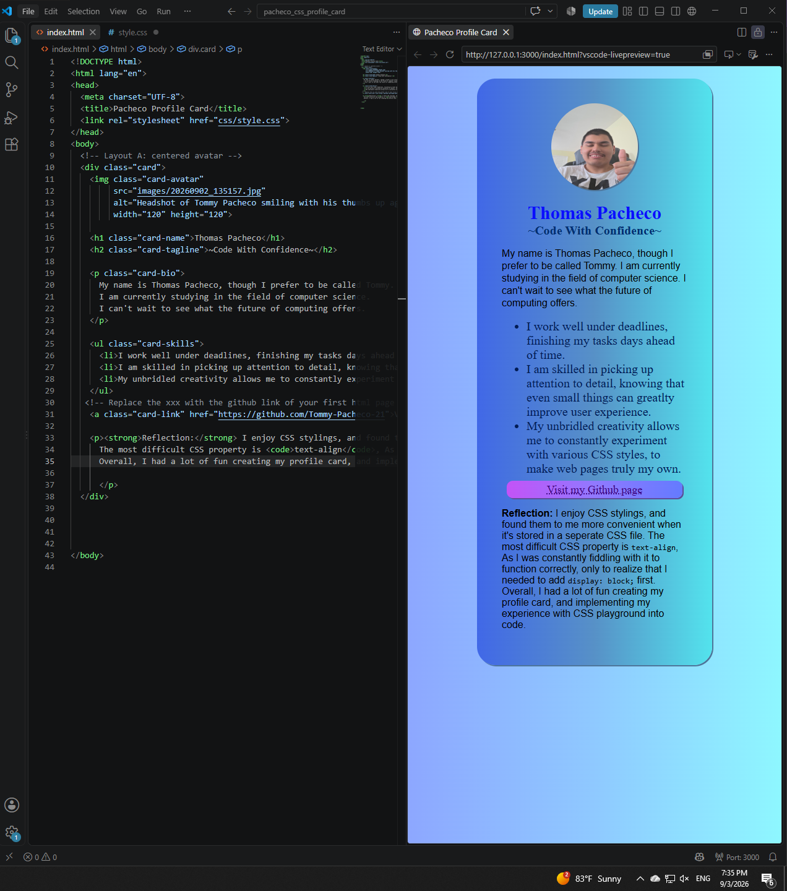

# CSS Profile Card — Tommy Pacheco

A single-page HTML5 demo built for ITD 210 (Web Page Design II)
at Northern Virginia Community College.

This page demonstrates the foundational CSS elements:
Stylings, Background, Padding, Margins, Box Shadows, Fonts, Gradients

## Screenshot

## Files

- `index.html` — the assignment page
- `style.css` — the page that houses all the CSS stylings
- `Screenshot.png` — the page rendered in a browser
- `Validator.png` — proof the page passes the W3C HTML validator
- `Headshot.png` — an image of the programmer for the purposes of the assignment

## Built with

HTML5. CSS framework, no JavaScript.
